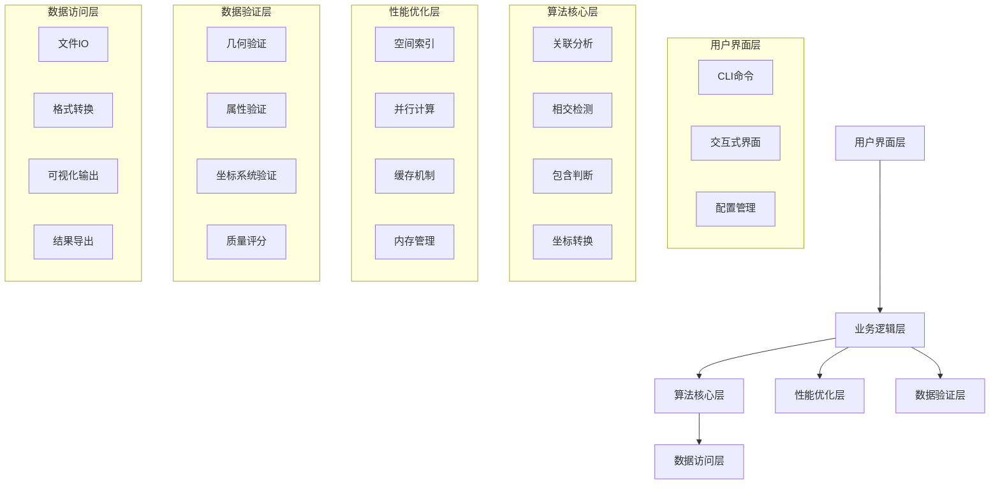

# 🗺️ GIS空间关联分析系统

<div align="center">


一个功能强大、高性能的地理空间要素关联分析工具

[快速开始](docs/user_manual/quick_start.md) • [安装指南](docs/user_manual/installation.md) • [API文档](docs/api/) • [使用示例](docs/user_manual/usage_examples.md)

</div>

## ✨ 主要特性

### 🎯 核心功能
- **点-线最近邻关联分析** - 高效找到点要素到线要素的最近关联
- **线-线相交检测分析** - 精确检测线要素之间的空间相交关系
- **线-面包含判断分析** - 准确判断线要素是否被面要素包含
- **坐标系转换处理** - 支持多种坐标系的相互转换
- **全面数据质量验证** - 完整的几何和属性数据验证修复

### ⚡ 性能特性
- **空间索引优化** - 基于Rtree的高效空间索引
- **并行计算支持** - 多进程并行处理大规模数据
- **内存缓存机制** - 智能缓存提升重复计算效率
- **进度监控可视化** - 实时显示处理进度和性能指标

### 🛠️ 易用性特性
- **命令行界面** - 直观易用的CLI工具
- **交互式操作** - 友好的交互式操作模式
- **配置管理** - 灵活的配置文件管理系统
- **丰富的输出格式** - 支持多种矢量数据格式输入输出

## 📋 系统要求

- **Python**: 3.8 或更高版本
- **操作系统**: Windows 10+, Linux, macOS 10.14+
- **内存**: 建议 4GB 以上（处理大数据集时需要更多内存）
- **存储**: 至少 1GB 可用空间

## 🚀 快速开始

### 安装

```bash
# 克隆项目
git clone https://github.com/your-repo/gis-spatial-association-system.git
cd gis-spatial-association-system

# 安装依赖
pip install -r requirements.txt

# 安装项目
pip install -e .
```

### 基本使用

```bash
# 查看版本信息
gis-association --version

# 点-线关联分析
gis-association process points.shp lines.shp --output result.gpkg

# 数据验证
gis-association validate data.geojson --repair

# 交互式模式
gis-association interactive
```

### Python API

```python
from gis_spatial_association import NearestNeighborAssociator
import geopandas as gpd

# 加载数据
points = gpd.read_file('points.shp')
lines = gpd.read_file('lines.shp')

# 创建关联分析器
associator = NearestNeighborAssociator(max_distance=1000.0)

# 执行关联分析
results = associator.associate(points, lines)

# 保存结果
results.to_file('associations.gpkg', driver='GPKG')
```

## 📖 文档导航

### 用户文档
- [📚 用户手册](docs/user_manual/)
  - [快速开始](docs/user_manual/quick_start.md)
  - [安装指南](docs/user_manual/installation.md)
  - [使用示例](docs/user_manual/usage_examples.md)
  - [CLI参考](docs/user_manual/cli_reference.md)
  - [故障排除](docs/user_manual/troubleshooting.md)

### API文档
- [🔧 API参考](docs/api/)
  - [算法模块](docs/api/algorithms/)
  - [性能模块](docs/api/performance/)
  - [验证模块](docs/api/validation/)
  - [CLI模块](docs/api/cli/)
  - [IO模块](docs/api/io/)

### 开发者文档
- [👨‍💻 开发者指南](docs/developer/)
  - [架构说明](docs/developer/architecture.md)
  - [开发环境](docs/developer/development_setup.md)
  - [贡献指南](docs/developer/contributing.md)
  - [代码规范](docs/developer/code_standards.md)

### 部署文档
- [🚀 部署指南](docs/deployment/)
  - [本地安装](docs/deployment/local_installation.md)
  - [Docker部署](docs/deployment/docker_deployment.md)
  - [服务器部署](docs/deployment/server_deployment.md)
  - [监控配置](docs/deployment/monitoring.md)

## 🏗️ 项目架构



## 🎯 使用场景

### 🏛️ 市政规划
- 道路与建筑物的关联分析
- 管线网络与设施的空间关系
- 城市功能区的空间分布分析

### 🌍 环境监测
- 监测站点与污染源的关联
- 生态廊道与保护区的连接性
- 水系与周边用地的相互关系

### 🚗 交通规划
- 公交站点与道路网络的匹配
- 交通设施与服务区域的关系
- 路径规划与障碍物的避让

### 📊 商业分析
- 客户分布与服务网点的覆盖
- 商圈与竞争对手的空间关系
- 供应链节点与运输路线的优化

## 🤝 贡献指南

我们欢迎所有形式的贡献！请查看 [贡献指南](docs/developer/contributing.md) 了解如何参与项目开发。

### 贡献方式
- 🐛 报告Bug
- 💡 提出新功能建议
- 📝 改进文档
- 🔧 提交代码
- 🧪 编写测试

## 📄 许可证

本项目采用 [MIT 许可证](LICENSE)。

## 🙏 致谢

感谢以下开源项目的支持：
- [GeoPandas](https://geopandas.org/) - 地理空间数据处理
- [Shapely](https://shapely.readthedocs.io/) - 几何对象操作
- [Rtree](https://rtree.readthedocs.io/) - 空间索引
- [PyProj](https://pyproj4.github.io/pyproj/stable/) - 坐标系转换
- [Rich](https://rich.readthedocs.io/) - 终端美化

## 📞 联系我们

- 📧 邮箱: support@gis-association.com
- 🐛 问题反馈: [GitHub Issues](https://github.com/your-repo/gis-spatial-association-system/issues)
- 💬 讨论: [GitHub Discussions](https://github.com/your-repo/gis-spatial-association-system/discussions)

---

<div align="center">

**[⬆️ 返回顶部](#️-gis空间关联分析系统)**

Made with ❤️ by CCPM Auto Development System

</div>