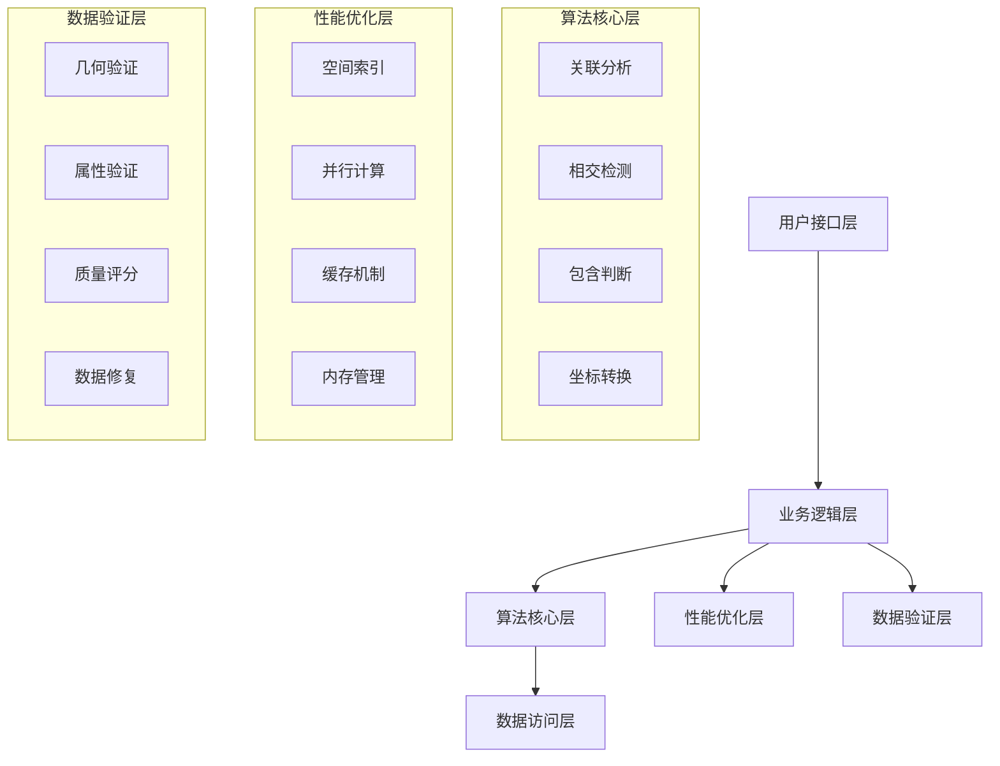

# 📚 API文档

欢迎访问GIS空间关联分析系统的完整API参考文档。本文档提供了所有模块、类和方法的详细说明。

## 📋 API概览

### 核心模块

| 模块 | 描述 | 主要类 |
|------|------|--------|
| [算法模块](algorithms/) | 空间分析算法实现 | NearestNeighborAssociator, LineIntersectionDetector, PolygonContainmentAnalyzer, CoordinateTransformer |
| [性能模块](performance/) | 性能优化和并行处理 | SpatialIndexer, ParallelProcessor, CacheManager, PerformanceMonitor |
| [验证模块](validation/) | 数据质量验证和修复 | GeometryValidator, AttributeValidator, DataQualityScorer, DataRepairer |
| [CLI模块](cli/) | 命令行界面 | CLIInterface, ConfigManager, ProgressMonitor |
| [IO模块](io/) | 数据输入输出和可视化 | DataLoader, ResultExporter, VisualizationEngine |

## 🔗 快速导航

### 按功能分类

#### 🎯 空间分析
- [点-线关联分析](algorithms/association.md) - 最近邻关联分析
- [线-线相交检测](algorithms/intersection.md) - 相交关系检测
- [线-面包含分析](algorithms/containment.md) - 包含关系判断
- [坐标系统转换](algorithms/transformation.md) - 坐标系转换

#### ⚡ 性能优化
- [空间索引](performance/indexing.md) - Rtree空间索引
- [并行处理](performance/parallel.md) - 多进程并行计算
- [缓存管理](performance/cache.md) - 智能缓存机制
- [性能监控](performance/monitoring.md) - 实时性能监控

#### ✅ 数据验证
- [几何验证](validation/geometry.md) - 几何有效性检查
- [属性验证](validation/attributes.md) - 属性完整性验证
- [质量评分](validation/quality.md) - 数据质量评估
- [数据修复](validation/repair.md) - 自动数据修复

#### 🖥️ 用户界面
- [CLI接口](cli/interface.md) - 命令行界面
- [配置管理](cli/config.md) - 配置文件管理
- [交互模式](cli/interactive.md) - 交互式操作

#### 📊 输入输出
- [数据加载](io/loaders.md) - 多格式数据加载
- [结果导出](io/exporters.md) - 多格式结果导出
- [可视化](io/visualization.md) - 结果可视化

## 🏗️ 架构概览



## 🚀 快速开始

### 基本使用示例

```python
from gis_spatial_association import NearestNeighborAssociator
import geopandas as gpd

# 加载数据
points = gpd.read_file('points.shp')
lines = gpd.read_file('lines.shp')

# 创建关联分析器
associator = NearestNeighborAssociator(max_distance=1000.0)

# 执行分析
results = associator.associate(points, lines)

# 保存结果
results.to_file('associations.gpkg', driver='GPKG')
```

### 高级使用示例

```python
from gis_spatial_association import (
    NearestNeighborAssociator,
    LineIntersectionDetector,
    PolygonContainmentAnalyzer,
    GeometryValidator,
    DataRepairer
)
import geopandas as gpd

# 加载数据
points = gpd.read_file('monitoring_stations.shp')
lines = gpd.read_file('river_network.shp')
polygons = gpd.read_file('protection_zones.shp')

# 数据验证和修复
validator = GeometryValidator()
repairer = DataRepairer()

validation_report = validator.validate(points)
if validation_report['has_issues']:
    points = repairer.repair(points)

# 点-线关联分析
associator = NearestNeighborAssociator(
    max_distance=2000,
    parallel=True,
    n_jobs=4
)
associations = associator.associate(points, lines)

# 线-线相交检测
intersection_detector = LineIntersectionDetector(tolerance=1.0)
intersections = intersection_detector.find_intersections(lines, lines)

# 线-面包含分析
containment_analyzer = PolygonContainmentAnalyzer(buffer_distance=100)
containment_relations = containment_analyzer.analyze_containment(lines, polygons)

print(f"发现 {len(associations)} 个关联关系")
print(f"检测到 {len(intersections)} 个交点")
print(f"分析出 {len(containment_relations)} 个包含关系")
```

## 📖 使用指南

### 1. 选择合适的算法

根据您的分析需求选择相应的算法类：

- **点-线关联**: 使用 `NearestNeighborAssociator`
- **线-线相交**: 使用 `LineIntersectionDetector`
- **线-面包含**: 使用 `PolygonContainmentAnalyzer`
- **坐标转换**: 使用 `CoordinateTransformer`

### 2. 配置算法参数

每个算法类都提供了丰富的配置选项：

```python
# 关联分析器配置
associator = NearestNeighborAssociator(
    max_distance=1000,           # 最大关联距离
    return_all_fields=True,      # 返回所有字段
    calculate_parallel_distance=True,  # 计算平行距离
    parallel=True,               # 启用并行处理
    n_jobs=4                     # 并行进程数
)

# 相交检测器配置
detector = LineIntersectionDetector(
    tolerance=1.0,               # 容差值
    include_overlaps=True,       # 包含重叠
    return_intersection_points=True  # 返回交点坐标
)
```

### 3. 数据预处理

在进行空间分析之前，建议先进行数据验证：

```python
from gis_spatial_association import GeometryValidator, AttributeValidator

# 几何验证
geom_validator = GeometryValidator()
geom_report = geom_validator.validate(your_data)

# 属性验证
attr_validator = AttributeValidator()
attr_report = attr_validator.validate(your_data)
```

### 4. 性能优化

对于大数据集，使用性能优化模块：

```python
from gis_spatial_association.performance import ParallelProcessor, CacheManager

# 并行处理
processor = ParallelProcessor(n_jobs=8)
results = processor.process_large_dataset(data_chunk_size=5000)

# 缓存管理
cache_manager = CacheManager()
cache_manager.enable_spatial_indexing()
```

### 5. 结果导出和可视化

```python
from gis_spatial_association.io import ResultExporter, VisualizationEngine

# 结果导出
exporter = ResultExporter()
exporter.to_geopackage(results, 'output.gpkg')
exporter.to_geojson(results, 'output.json')

# 可视化
viz = VisualizationEngine()
viz.create_association_map(results, output_path='associations_map.png')
```

## 🔧 扩展开发

### 自定义算法

```python
from gis_spatial_association.algorithms.base import BaseSpatialAnalyzer

class CustomAnalyzer(BaseSpatialAnalyzer):
    def __init__(self, **kwargs):
        super().__init__(**kwargs)
        # 自定义初始化

    def analyze(self, input_data, **kwargs):
        # 实现自定义分析逻辑
        pass
```

### 自定义验证器

```python
from gis_spatial_association.validation.base import BaseValidator

class CustomValidator(BaseValidator):
    def validate(self, data, **kwargs):
        # 实现自定义验证逻辑
        return validation_report
```

## 📊 性能基准

### 硬件要求

| 数据规模 | 推荐内存 | 推荐CPU | 处理时间 |
|---------|---------|---------|---------|
| 10K要素 | 4GB | 4核 | < 1分钟 |
| 100K要素 | 8GB | 8核 | 5-10分钟 |
| 1M要素 | 32GB | 16核 | 30-60分钟 |
| 10M要素 | 128GB | 32核 | 2-4小时 |

### 性能优化建议

1. **启用空间索引**: 对于大数据集，确保启用空间索引
2. **并行处理**: 使用多进程并行计算
3. **内存管理**: 合理设置分块大小
4. **数据预处理**: 提前过滤和清理数据
5. **缓存策略**: 重用计算结果

## 🧪 测试和调试

### 单元测试

```python
import unittest
from gis_spatial_association import NearestNeighborAssociator

class TestAssociationAnalyzer(unittest.TestCase):
    def setUp(self):
        self.associator = NearestNeighborAssociator(max_distance=1000)

    def test_association(self):
        # 测试关联分析
        pass
```

### 调试模式

```python
import logging
from gis_spatial_association import set_log_level

# 启用详细日志
set_log_level('DEBUG')

# 或者配置日志
logging.basicConfig(
    level=logging.DEBUG,
    format='%(asctime)s - %(name)s - %(levelname)s - %(message)s'
)
```

## 📞 获取帮助

### 技术支持

- 📧 技术支持: support@gis-association.com
- 📖 在线文档: https://gis-association.readthedocs.io/
- 🐛 Bug报告: [GitHub Issues](https://github.com/your-repo/gis-spatial-association-system/issues)
- 💬 社区讨论: [GitHub Discussions](https://github.com/your-repo/gis-spatial-association-system/discussions)

### 代码示例

更多代码示例请参考：
- [使用示例](../user_manual/usage_examples.md)
- [测试用例](https://github.com/your-repo/gis-spatial-association-system/tree/main/tests)
- [Jupyter Notebooks](https://github.com/your-repo/gis-spatial-association-system/tree/main/examples)

---

**开始探索GIS空间关联分析系统的强大功能吧！🚀**